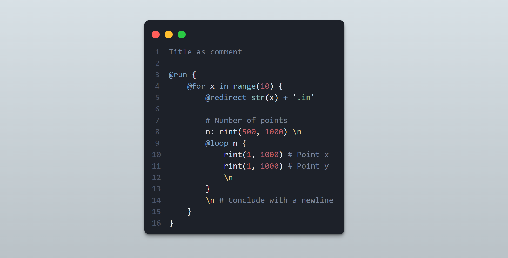

## A Simple Goal

It all started a year ago, when, as a freshman majoring computer science, I found myself in constant need of generating large sets of structured data to test algorithms implemented in C++. Most contented themselves with writing small scripts in Python or native C++ to generate random data, but I wanted something more efficient and scalable. I talked with [RogerFlowey](https://github.com/RogerFlowey), and after some heated discussions, MkData was born.

The idea is simple enough: Programming languages are powerful, yet this power means that for specialized tasks like data generation, boilerplate code is often needed (for instance, to format output). All we need is a flexible [domain-specific language](https://en.wikipedia.org/wiki/Domain-specific_language) that can express the structure of the data we want to generate, and a command-line tool (an interpreter) that will generate the data for accordingly.

## A Journey of Iterations

### From GUI to CLI

Previously, I had made some attempts at building batch generation tools. The first generation of MkData looks like this:


I was learning frontend at that time, so I used Vue for the UI. It was a fun project, and (more or less) a good-looking one, but being web app limited its practical functionality. I soon realized that a GUI is not ideal for a generator. It makes much more sense to focus on core language features, and expose a command-line interface for users to interact with.

I decided to rewrite MkData from scratch, this time as a Python package. After installation, it functions as a command-line tool.

```bash
pip install mkdata
```

Or, with other package managers:

```bash
pipx install mkdata
uv tool add mkdata
```

### Nailing the Syntax

Deciding on the syntax of MkData took time. I wanted it to be **as concise as possible**, without sacrificing extensibility. After several iterations (as a ton of discussions with RogerFlowey), I settled with a half-Pythonic, half-Cpp-ish syntax.



It might not be perfect, but is as close as we could get to our goal. The beautiful thing is that, since MkData is based on Python, it evaluates all expressions and blocks using Python's own interpreter. This means that **all Python expressions are valid in MkData**, making it extremely powerful and extensible. There is even a `@python` directive that allows you to write arbitrary Python code blocks in MkData files.

In accordance to C++ redirection, MkData provides a `@redirect` directive to redirect output to files, stdout or stderr. In combination with loops, it can be used to generate multiple files in one go.

One of the most annoying things about writing data generation scripts is formatting output. The formatting syntax in MkData is done solely through appending format specifiers to the end of each enactive statement, like `\n` for newline. This makes it easy to read and write.

The builtins of MkData (like `rint` for random int, `rstr` for random string), are, in fact. defined in a python script, which is run at launch-time to capture its environment. If future versions, MkData will support user-defined starting scripts, allowing users to define their own builtins. [A reform of the standard library](https://github.com/RayZh-hs/mkdata/tree/feature/extend-preimport) is currently underway at the time of writing, which aims to provide extensive utility as well as a uniform interface for builtins.

### Speeding Up

MkData is implemented in Python, which is not the fastest language out there, but we have done our best to optimize it. Before execution, the script is stepped through and blocks are compiled into [Python Code Objects](https://stackoverflow.com/questions/22443939/python-built-in-function-compile-what-is-it-used-for), and after the tree is fully constructed, it is executed in a single pass. This makes MkData fast enough for most use cases.

## What's Next?

MkData is still a young project, and there are many features requested so far. Some ideas we have in mind include:

- Full support for user-defined startup scripts;
- Support for global seeding (implemented in [this branch](https://github.com/RayZh-hs/mkdata/tree/feature/seed));
- Extend the builtin library (see [this branch](https://github.com/RayZh-hs/mkdata/tree/feature/extend-preimport)).

We have also created a VSCode extension for MkData, providing syntax highlighting and snippets. Feel free to check it out on the [VSCode Marketplace](https://marketplace.visualstudio.com/items?itemName=rayzh.mkdata-intellisense).

---

Here is the source code for all projects mentioned in this post:

- [MkData](https://github.com/RayZh-hs/mkdata)
- [MkData Intellisense](https://github.com/RayZh-hs/mkdata-intellisense)

If you have any questions or suggestions, feel free to open an issue on the MkData repository, or reach out to me via [email](mailto:ray_zh@sjtu.edu.cn). Thank you for reading!

Attribution: Thumbnail image by <a href="https://unsplash.com/@ereneskiz?utm_content=creditCopyText&utm_medium=referral&utm_source=unsplash">Eren Namlı</a> on <a href="https://unsplash.com/photos/shape-arrow-aZt4hpRwqaE?utm_content=creditCopyText&utm_medium=referral&utm_source=unsplash">Unsplash</a>
