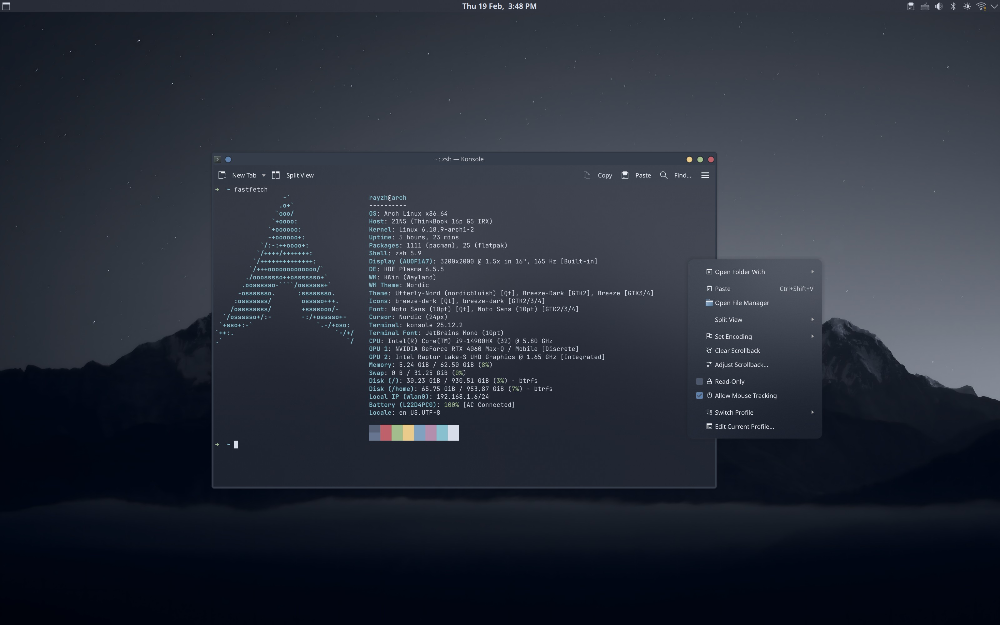
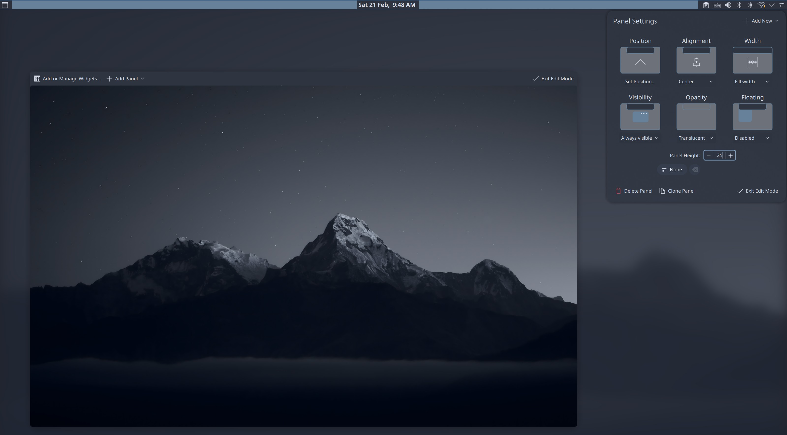
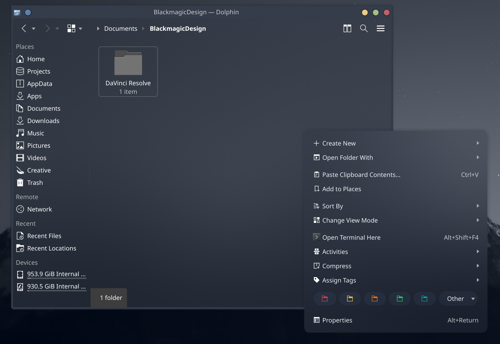
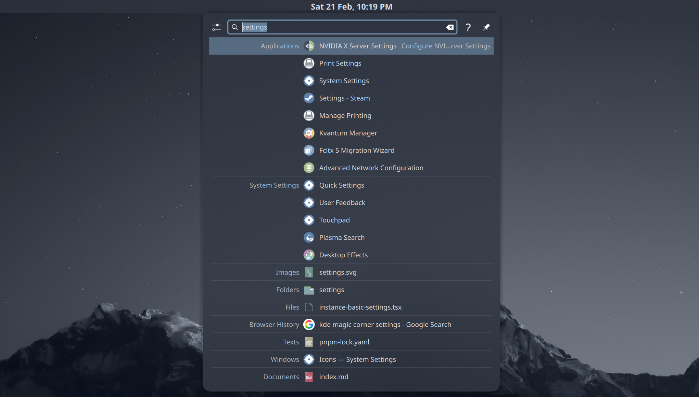

Two weeks ago I decided to make the switch from Windows to Arch Linux. When selecting a desktop environment, I found myself choosing between KDE Plasma and GNOME. Having used GNOME before, I decided to give KDE Plasma a try, since I have heard that it is highly customizable.

I like KDE Plasma for its clean interface and powerful customization options, but the default theme seems less modern compared to the polished and unified look of GNOME. Therefore I decided to remix my own theme for KDE Plasma, based on the popular Nord color palette.

Technically, *Simply Nord* is not a theme, but rather a collection of themes, kwin scripts, widgets, panels and many more customizations, all combined to provide a beautiful, minimalistic desktop experience. I drew inspiration from GNOME, Dank Material Theme, and multiple desktop designs, recreating a keyboard-driven workflow that blends productivity and aesthetics.



{{ Figure 1: Screenshot from the Simply Nord Theme. }}

In this blog post, I will share the process of creating *Simply Nord*, so that you can easily set it up on your KDE Plasma desktop.

## Designing the Workflow

Looks are important, but what is more important is the **workflow** behind the design. It is always important to take a while to think about how you **wish to access** the myriad of applications and actions provided by the desktop environment. Think about how you want to launch applications, access opened windows, switch between workspaces, and so on. Be consistent in your design, and use your desired workflow to guide your design decisions.

!light[workflow](workflow-light.svg)
!dark[workflow](workflow-dark.svg)

{{ Figure 2: The workflow diagram of the Simply Nord Theme. }}

For *Simply Nord*, the workflow I chose is aggressively keyboard-driven. I got rid of the task manager altogether, and chose to rely on KRunner to launch applications and the Window Switcher to switch between opened windows. I work on a laptop, and frequently do not use a mouse, so I extended the touchpad gestures. I use three-finger swipes to open the Overview Effect, and four-finger swipes to switch between workspaces. The strong emphasis on keyboard and touchpad navigation allowed me to create a clean and minimalistic desktop.

If you are interested in adopting the theme, but are uncomfortable with a keyboard-driven workflow, you should consider adding a task manager and modifying the shortkeys to your liking. This is the primary reason why I chose to produce a blog tutorial instead of a ready-to-use, drop-and-go konsave archive.

## First Things First: Backup Your Theme

Before you start modifying your desktop, it is always a good idea to make a backup of your current configuration. The latest edition of KDE Plasma already provides built-in support for exporting and importing desktop configurations, but for complex setups like this I prefer to use [Konsave](http://github.com/Prayag2/konsave) since it is more flexible.

```bash
konsave --save kde-standard
```

After this, you should be ready to start modifying your desktop. You can always restore the backup using the following command:

```bash
konsave --apply kde-standard
```

## Playing with Panels



In KDE Plasma, the default panel closely resembles the Windows taskbar. It spans the entire width of the screen and contains primarily a task manager as well as the system tray. Classic design as it is, it does not fit the modern and minimalistic look I was going for. Therefore, I moved the panel to the top of the screen, and turned it into a top bar. You can do so by right-clicking on the panel, selecting *Show Panel Configuration* and modifying the settings to:

- Position: Top
- Visibility: Always Visible
- Floating: Disabled

The last two configuration options disable the "hiding" behavior of the panel, making it always visible. The default panel is a bit too thick, so I reduced the height to 25 pixels.

!light[top-bar](top-bar-light.svg)
!dark[top-bar](top-bar-dark.svg)

As for widgets, I removed the task manager and displayed the time in the center, using `ddd d MMM,` to display the date besides the time within the same line. The leftside `Toggle Overview` button is from the [KDE Store](https://store.kde.org/p/2132554) with a custom icon.

### Addressing the Animation Issue

One issue I encountered is that, after removing all task managers from the screen, the `Squash` animation for minimizing windows stops working. I have reported this as a [bug](https://bugs.kde.org/show_bug.cgi?id=516180), and hopefully in a future update this will be fixed.

In the meantime, you can use [my fork of Squash Plus](https://github.com/RayZh-hs/Squash-Plus/) which provides a "Minimize To" configuration option. You can set this to any of the fixed positions on the screen, which fixes this issue.

In my case, I set it to the top left corner, which is where the `Toggle Overview` button is located, and where the magic corner is set to toggle the overview too. This way it seems that windows are minimized to the Overview screen, which makes for consistency in the design.

## Hotkeys and Touchpad Gestures

KDE Desktop provides a powerful system for configuring hotkeys under the "Keyboard > Shortcuts" settings. The configuration I am using:

- `Alt + Space`: Open KRunner
- `Alt + F4`: [Close Window or Log Out](https://store.kde.org/p/2138867)
- `Meta + E`: Open Dolphin
- `Meta + C`: Open Chrome
- `Meta + K`: Open Konsole
- Additional KWin Script: Geometry Change

However, the almighty KDE Plasma seems to be in surprising lack of touchpad customization options. To solve this issue I resorted to using [Input Actions](https://github.com/taj-ny/InputActions), a community-developed tool that provides cross-desktop support for input device triggers. Here is the script I am using to configure the touchpad gestures:

```yaml
touchpad:
  gestures:
    # Three-finger swipe to cycle between tabs
    - type: swipe
      fingers: 3
      direction: left_right
      actions:
        # 1. Start: Hold Alt and tap Tab once to open the menu
        - on: begin
          input:
            - keyboard: [ +leftalt, tab ]

        # 2. Moving Left: Cycle backwards (Shift+Tab)
        - on: update
          interval: -75
          input:
            - keyboard: [ leftshift+tab ]

        # 3. Moving Right: Cycle forwards (Tab)
        - on: update
          interval: 75
          input:
            - keyboard: [ tab ]

        # 4. End: Release Alt to select the window
        - on: end
          input:
            - keyboard: [ -leftalt ]

        # 5. Cancel: Release Alt if gesture is interrupted
        - on: cancel
          input:
            - keyboard: [ -leftalt ]

    # 3 Fingers Up -> Spreadsheet View (Desktop Grid)
    - type: swipe
      fingers: 3
      direction: up
      actions:
        - on: begin
          input:
            - keyboard: [ leftmeta+w ]

    # Wait for 3 finger down to exit spreadsheet view
    - type: swipe
      fingers: 3
      direction: down
      actions:
        - on: begin
          input:
            - keyboard: [ leftmeta+w ]

    # 4 Fingers Up -> Task View (Desktop Grid)
    - type: swipe
      fingers: 4
      direction: up
      actions:
        - on: begin
          input:
            - keyboard: [ leftmeta+g ]
```

This configuration modifies the three-finger swipe to open the Overview Effect, and the four-finger swipe to switch between workspaces. You can modify the configuration to your liking, and add more gestures if you wish.

## Color Theme Support

> Light attracts bugs. Dark attracts developers.

I set out by browsing the KDE Store for [Nord](https://www.nordtheme.com/) color schemes. Several options are available, but I ended up choosing [Nordic Bluish KDE](https://store.kde.org/p/1801641) theme for most setups:

- Colors: Nordic Bluish
- Application Style: Kvantum (I will cover this later)
- Plasma Style: Nordic Bluish
- Window Decorations: Nordic
- Icons: Breeze Dark (See more in [Icons](#icons))
- Cursors: Nordic-Cursors

Compared with builtin color theme support, I prefer to use [Kvantum](https://github.com/tsujan/Kvantum) to provide better support for qt applications, since it comes with enhanced flexibility and capability. [Utterly Nord Plasma](https://github.com/HimDek/Utterly-Nord-Plasma) is a qt theme with great support for acrylic and blur effects, and is the one I am using for *Simply Nord*. I especially like its dropdown menu design, which is brings out the subtle use of colors in the Nord palette.



Ensure that you have "Blur" enabled in "Desktop Effects" settings. It should be pointed out that that the default Utterly Nord Plasma theme is rather aggressively transparent, which makes some windows such as Kate and Dolphin look weird on light backgrounds. The workaround I found is to use the "Kvantum Solid" variation of the theme and, under Application Themes, apply it to windows that are frequently moved above light backgrounds with the "Application Themes" section in Kvantum.

Another tip: I found that the Nordic Bluish color scheme in Dolphin is a bit unclear. The solution is to "Settings > Configure > Window Color Scheme" and use another. I strongly recommend [Nordic Darker](https://store.kde.org/p/1633673), which looks crisp and clear with the default white Breeze Icons.

## Wallpaper and Screens

The wallpaper that I am using comes from a [Reddit post](https://www.reddit.com/r/wallpaper/comments/106xrta/1920x1080_nordic_mountains/). It should be noted that for some reason the image you download from the post is of 4717×2984 resolution despite it being said to be 1920×1080. For best quality you can downscale it to 1080p and then upscale it back to 4K using a tool like [Upscayl](https://github.com/upscayl/upscayl). This will significantly reduce blur. Or, simply click the link below to download the wallpaper that I upscaled:

[Upscaled Wallpaper](/download/simply-nord-wallpaper-4x.png "attachment")

Remember to set the wallpaper in **two places**: the "Login Screen (SDDM)" and the "Screen Locking" settings. Set both to "Breeze" and use the configuration button to set the wallpaper to the one you downloaded.

## Icons

Icons are arguably the hardest part to configure in a typical KDE Plasma desktop. Many of the icon sets that I found seem to be incomplete, and using them leads to visual inconsistencies. Therefore, I settled on using the default Breeze Dark icons as the base, and building icon overrides across applications.

It turns out that KRunner has a dedicated `~/.config/krunnerrc` configuration file, where you can specify icon sets to use for KRunner specifically. For the nord theme, both [Zafiro Icons](https://github.com/zayronxio/Zafiro-icons) and its fork [Zafiro Nord Dark](https://github.com/zayronxio/Zafiro-Nord-Dark) works perfectly. You can use them by cloning them (or cloning and copying the `Dark` folder) into `~/.local/share/icons/` and setting:

```
[Icons]
Theme=Zafiro-Nord-Dark
```

However, I noticed that both icon sets modify the top search bar of KRunner, which I dislike. To resolve this issue, we will build a custom icon set that inherits the zafiro icons but overrides the search bar icons.


{{ Figure 3: The KRunner with modified Zafiro Icon Set. }}

To this end, we would first need to figure out the names of these icons used. This is surprisingly difficult, since I have not found any builtin tool in KDE Plasma to inspect icons. After much research, I found [Breeze Icons Debug](https://github.com/etherfield/breeze-icons-debug) by etherfield, an icon set that replaces all icons with an image consisting of the icon id. This allowed me to easily identify the icons used in the KRunner search bar, and I built this custom icon set:

```plaintext  
~/.local/share/icons/KRunner-Icons-Override
├── actions
│   ├── 24
│   │   ├── edit-clear-locationbar-rtl.svg
│   │   └── search.svg
│   └── 48
│       ├── configure.svg
│       ├── expand.svg
│       ├── question.svg
│       └── window-pin.svg
├── append
└── index.theme
```

The `index.theme` file is as follows:

```ini
[Icon Theme]
Name=Simply Nord: KRunner Icons Override
Comment=KRunner override icons for theme Simply Nord
Inherits=Zafiro-Nord-Dark,breeze-dark

Directories=actions/24,actions/48

[actions/24]
Size=24
Context=Actions
Type=Fixed

[actions/48]
Size=48
Context=Actions
Type=Fixed
```

In the directories, I copied icons sampled from the Breeze Dark icon set. I will provide the python I used to extract these icons and follow symbolic links:

[Python Script for Icon Extraction & Append](/download/icon-append.py "attachment")

As you have seen in Image 3, the search bar icons are now overridden to match the Breeze Dark icons, while the rest of the KRunner icons are inherited from the Zafiro Nord Dark icon set. The result is a vastly more consistent and polished look for KRunner.

Similarly, you can override the folder icons in Dolphin to adjust the colored folders to match the Nord palette.

## Final Touch: Fonts

Fonts matter. People often complain about the default fonts in Linux look ... well, a bit outdated, but this problem is absolutely solvable. First, install fonts of your choice. I am using [Noto Sans](https://www.google.com/get/noto/) for user interface, and [JetBrains Mono](https://www.jetbrains.com/lp/mono/) for monospace usage like in terminals. When it comes to Asian typography, [Source Hans Serif](https://source.typekit.com/source-han-serif/) is my primary choice for documents.

Change the font in the digital clock in the top bar to 8pt Noto Sans. See how much that affects the overall feel of the desktop? We consider fonts as the final touch to the desktop configuration, since they make up much of the micro-details that make the desktop brilliant. 

Font management in linux can be tricky, since what you ask for is not always what you get. For example, the famous "Arial" font is actually replaced by "Liberation Sans" in most Linux distributions.

For me, I noticed that the default font system used "FreeSans" for symbol glyphs, which led to issues where the arrow symbol is not vertically centered and so on. Whenever you encounter such issues, you can use the `fontconfig` system to set up font fallbacks and overrides.

```
fc-match -s "sans-serif:charset=2192" | head
```

This will show you the font fallback chain for the arrow symbol (modify 2192 to the codepoint of the symbol you are looking up). To resolve such issues, create your own configuration files in `~/.config/fontconfig/conf.d/` and specify font fallback rules. One trick that I found was that in most circusmstances, Noto Sans Symbols seemed to have better glyph design.

```xml
<?xml version='1.0'?>
<!DOCTYPE fontconfig SYSTEM 'urn:fontconfig:fonts.dtd'>
<fontconfig>
 <!-- Strip Noto Sans Symbols of Latin characters -->
 <match target="scan">
  <test name="family">
   <string>Noto Sans Symbols</string>
  </test>
  <edit mode="assign" name="charset">
   <minus>
    <name>charset</name>
    <charset>
     <range>
      <int>0x0030</int>
      <int>0x0039</int>
     </range>
     <!-- 0-9 -->
     <range>
      <int>0x0041</int>
      <int>0x005A</int>
     </range>
     <!-- A-Z -->
     <range>
      <int>0x0061</int>
      <int>0x007A</int>
     </range>
     <!-- a-z -->
    </charset>
   </minus>
  </edit>
 </match>
 <!-- When querying sans-serif fonts, resort to Noto Sans Symbols for symbols -->
 <match target="pattern">
  <test name="family" qual="any">
   <string>Arial</string>
  </test>
  <edit binding="strong" mode="prepend" name="family">
   <string>Noto Sans Symbols</string>
  </edit>
 </match>
 <match target="pattern">
  <test name="family" qual="any">
   <string>Roboto</string>
  </test>
  <edit binding="strong" mode="prepend" name="family">
   <string>Noto Sans Symbols</string>
  </edit>
 </match>
 <match target="pattern">
  <test name="family" qual="any">
   <string>sans-serif</string>
  </test>
  <edit binding="strong" mode="prepend" name="family">
   <string>Noto Sans Symbols</string>
  </edit>
 </match>
 <dir>~/.local/share/fonts</dir>
</fontconfig>
```

This script effectively applys Noto Sans Symbols as the fallback font for all sans-serif symbol fonts. We need to strip Noto Sans Symbols of Latin characters since it contains such a sample sequence, which will otherwise take precedence over fonts the browser queries for letters.

Each time you modify the font configuration, make sure to clear the font cache:

```bash
fc-cache -f
```

Take some time to experiment with fonts in all your applications, and make sure that each modification you make does not introduce new issues in font rendering. This will help you achieve a consistent and polished look across your desktop.

That's all! When you are done, you should have a beautiful, minimalistic KDE Plasma desktop ready to go. Happy theming!